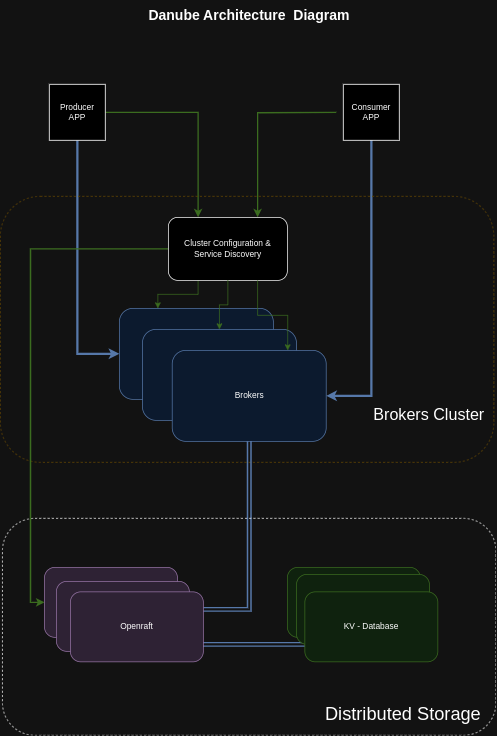

# Danube Architecture

High Level:

* One or more brokers handles and load balances incoming messages from producers, dispatches messages to consumers,
* communicates with the Service Discovery that handle various coordination tasks
* stores messages in Distributed Storage layer

## Diagram

## Brokers Cluster

### Service Discovery & Configuration

An HTTP server that exposes a REST API for both administrative tasks and topic lookup for producers and consumers.

Used for cluster-level metadata storage, configuration and coordination. Maintain the metadata store of the Danube Cluster, such as topic metadata, broker load data and others.  

Service discovery is a mechanism that enables connecting clients to use just a single URL to interact with the cluster.

### Brokers

A cluster consist of one or more Danube Brokers.

The producers connect to the brokers to publish messages and the consumers connect to the brokers to consume the messages.

A dispatcher, which is an asynchronous TCP server over a custom binary protocol used for all data transfers

Messages are typically dispatched out of a in memory cache for the sake of performance. If the backlog grows too large for the cache, the broker will start reading entries from the distributed storage.

## Storage Cluster

It provides message delivery guarantee for applications. If a message successfully reaches the Danube broker, it will be delivered to its intended target.

This guarantee requires that non-acknowledged messages are stored durably until they can be delivered to and acknowledged by consumers. This mode of messaging is commonly called persistent messaging.

Use [Raft](https://raft.github.io/) consensus protocol to durable store N copies of the data in the selected Database. The project is using the [OpenRaft](https://datafuselabs.github.io/openraft/) Rust implementation.

## Data Structure (Ledgers)

A ledger is an append-only data structure with a single writer that is consistently stored in Storage Layer.

* A broker can create a ledger, append entries to the ledger, and close the ledger.
* After the ledger has been closed---either explicitly or because the writer process crashed---it can then be opened only in read-only mode.
* Finally, when entries in the ledger are no longer needed, the whole ledger can be deleted from the system

**Managed Ledger** is a library on top of the ledger called the managed ledger that represents the storage layer for a single topic. A managed ledger represents the abstraction of a stream of messages with a single writer that keeps appending at the end of the stream and multiple consumers that are consuming the stream.

* After a failure, a ledger is no longer writable and a new one needs to be created.
* A ledger can be deleted when all cursors have consumed the messages it contains.

Internally, a managed ledger uses comunicate with the Storage Layer to store the data.
