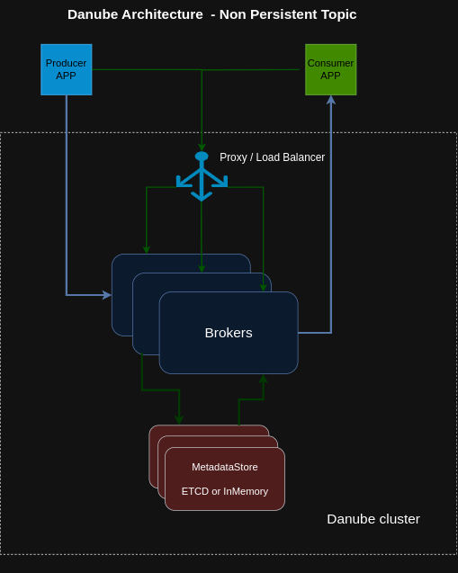
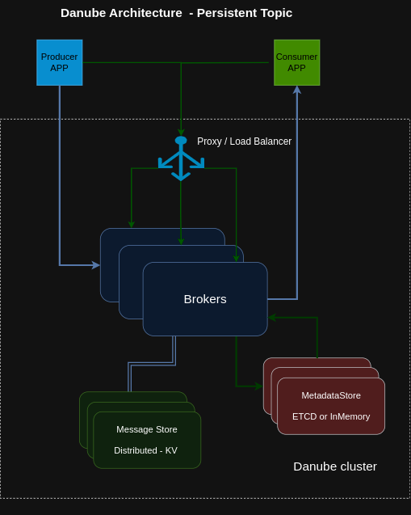

# Danube Architecture

## Non-Persistent Topic

### Only Non-Persistent Topics are supported for the moment

Non-Persistent means that the messages reside only in memory. They are faster but not guaranteed to survive broker crashes or consumer disconnections. Useful for situations where message loss is tolerable. The producers are allowed to send messages to Topics even if there are no active consumers. If no consumers are found the messages are droped.

### Brokers

A cluster consist of one or more Danube Brokers.

The producers connect to the brokers to publish messages and the consumers connect to the brokers to consume the messages.

Messages are dispatched immediatelly to available consumers, for increased performance.

### MetadataStore

Used for cluster-level metadata storage, configuration and coordination. Maintain the metadata store of the Danube Cluster, such as namespace / topic metadata, broker load data and others.

## Persistent Topic

Persistent means the messages are stored durably on disk (across multiple disks for reliability). This ensures message survival even during broker restarts or consumer failures. Ideal for critical data where message loss is unacceptable.

### _Brokers

A cluster consist of one or more Danube Brokers.

The producers connect to the brokers to publish messages and the consumers connect to the brokers to consume the messages.

Messages are typically dispatched out of a in memory cache for the sake of performance. If the backlog grows too large for the cache, the broker will start reading entries from the distributed storage.

### _MetadataStore

Used for cluster-level metadata storage, configuration and coordination. Maintain the metadata store of the Danube Cluster, such as namespace / topic metadata, broker load data and others.

### Message Store

It provides message delivery guarantee for applications. If a message successfully reaches the Danube broker, it will be delivered to its intended target.

This guarantee requires that non-acknowledged messages are stored durably until they can be delivered to and acknowledged by consumers. This mode of messaging is commonly called persistent messaging.
