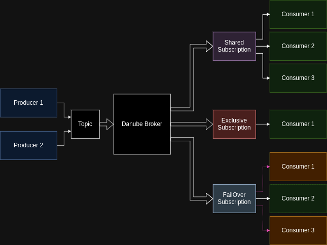

# Danube Clients

## Client Setup

Before an application creates a producer/consumer, the  client library needs to initiate a setup phase including two steps:

* The client attempts to determine the owner of the topic by sending a Lookup request to Broker.  
* Once the client library has the broker address, it creates a RPC connection (or reuses an existing connection from the pool) and (in later stage authenticates it ).
* Within this connection, the clients (producer, consumer) and brokers exchange RPC commands. At this point, the client sends a command to create producer/consumer to the broker, which will comply after doing some validation checks.

TODO: Reconnection with exponential backoff .Whether the TCP connection breaks, the client immediately re-initiates this setup phase and keeps trying to re-establish the producer or consumer until the operation succeeds.



## Producer

A producer is a process that attaches to a topic and publishes messages to a Danube broker. The Danube broker processes the messages.

**Access Mode** is a mechanism to determin the permissions of producers on topics.

* **Shared** - Multiple producers can publish on a topic.
* **Exclusive** - If there is already a producer connected, other producers trying to publish on this topic get errors immediately.

### Example

```rust
let client = DanubeClient::builder().service_url("http://[::1]:6650").build().unwrap();
let topic = "/markets/trade-events".to_string(); // Topics are defined as /{namespace}/{tiopic_name}

let json_schema = r#"{"type": "object", "properties": {"field1": {"type": "string"}, "field2": {"type": "integer"}}}"#.to_string();

let mut producer = client.new_producer().with_topic(topic).with_name("test_producer1")
        .with_schema("my_app".into(), SchemaType::Json(json_schema)).build();
producer.create().await?;

let data = json!({
            "field1": format!{"value{}", i},
            "field2": 2020+i,
        });

// Convert to string and encode to bytes
let json_string = serde_json::to_string(&data).unwrap();
let encoded_data = json_string.as_bytes().to_vec();
 producer.send(encoded_data).await?;

```

## Consumer

A consumer is a process that attaches to a topic via a subscription and then receives messages.

**Subscription Types** - describe the way the consumers receive the messages from topics

* **Exclusive** -  Only one consumer can subscribe, guaranteeing message order.
* **Shared** -  Multiple consumers can subscribe, messages are delivered round-robin, offering good scalability but no order guarantee.
* **Failover** - Similar to shared subscriptions, but multiple consumers can subscribe, and one actively receives messages.

```rust
let client = DanubeClient::builder().service_url("http://[::1]:6650").build().unwrap();
let topic = "/markets/trade-events".to_string(); // Topics are defined as /{namespace}/{tiopic_name}

let mut consumer = client.new_consumer().with_topic(topic).with_consumer_name("test_consumer")
        .with_subscription("test_subscription").with_subscription_type(SubType::Exclusive).build();

// Subscribe to the topic
consumer.subscribe().await?;

// Start receiving messages
let mut message_stream = consumer.receive().await?;
while let Some(message) = message_stream.next().await {
    //process the message and ack for receive
}

```
