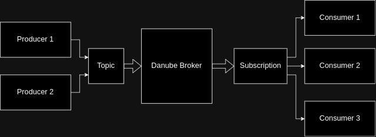

# Danube Clients

## Client Setup

Before an application creates a producer/consumer, the  client library needs to initiate a setup phase including two steps:

* The client attempts to determine the owner of the topic by sending an HTTP lookup request to the service discovery service.  
* Once the client library has the broker address, it creates a TCP connection (or reuses an existing connection from the pool) and (in later stage authenticates it ).
* Within this connection, the client and broker exchange binary commands from a custom protocol. At this point, the client sends a command to create producer/consumer to the broker, which will comply after having validated the authorization policy.

Whether the TCP connection breaks, the client immediately re-initiates this setup phase and keeps trying with exponential backoff to re-establish the producer or consumer until the operation succeeds.

## Producer

A producer is a process that attaches to a topic and publishes messages to a Danube broker. The Danube broker processes the messages.

**Access Mode** is a mechanism to determin the permissions of producers on topics.

* **Shared** - Multiple producers can publish on a topic.
* **Exclusive** - If there is already a producer connected, other producers trying to publish on this topic get errors immediately.

## Consumer

A consumer is a process that attaches to a topic via a subscription and then receives messages.

